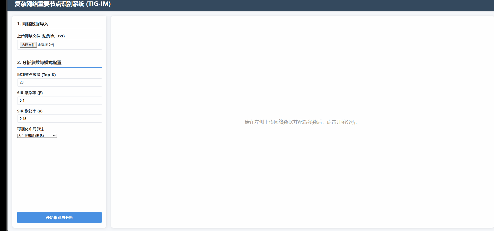

 
  <h1>“脉络”——复杂网络重要节点识别与交互式分析系统</h1>
  
  

    <strong>一个集智能识别、多维分析、动态可视化和跨屏协同于一体的复杂网络分析平台。</strong>
  

   

  

    
  

---

**“脉络”** 旨在解决传统网络分析工具在核心节点识别精度、分析深度和交互体验上的不足，为科研与行业用户构建了一个“可解释、可推演、可协同”的分析新范式。

> ⚠️ **当前状态**: 本项目的核心算法与系统架构已申请中华人民共和国国家软件著作权。为保护知识产权，源代码将在登记完成后逐步开源。感谢您的理解与关注！

---

## 🌟 核心特性

-   **🧠 智能识别**: 搭载自研 **TIG-IM** 两阶段GNN算法，精准识别兼具高影响力与多样性的“点火”节点集。
-   **🔬 深度分析**: 提供网络全景洞察、算法机理剖析、SIR动态仿真、鲁棒性对比等一站式分析能力。
-   **📱 跨屏协同**: PC-手机“**驾驶舱**”模式，基于 **Flask-SocketIO** 实现宏观与微观视角的实时同步。
-   **🤖 AI 辅助**: 集成**AI场景生成器**与“**图灵灵智能问答助手**”，降低专业分析门槛。

---

## 🎬 功能演示

#### 1. AI辅助建模 & 多样化布局
无需专业知识，用自然语言即可构建网络。系统提供多种布局算法，助您从不同视角洞察网络结构。

  
<strong>✨ 点击展开/折叠 GIF 演示</strong>

  
  **AI 智能建模**
  
  

  **多样化可视化布局**
  | **力引导布局** | **社区感知布局** |
  | :---: | :---: |
  |  |  |
  | **环形布局** | **随机布局** |
  | :---: | :---: |
  |  |  |

#### 2. 多算法对比 & 性能评估
一键切换不同算法，直观对比节点选择差异，并查看详细的性能评估图表。

  
<strong>✨ 点击展开/折叠 GIF 演示</strong>

  
  **节点高亮切换**
  

  **性能对比图表**
  

#### 3. 动态传播模拟 & 交互式推演
将核心节点作为感染源，动态、可交互地观察SIR模型的传播过程，亲眼见证“点火效应”。

  
<strong>✨ 点击展开/折叠 GIF 演示</strong>

  
  

#### 4. 跨屏协同驾驶舱 (核心创新)
PC端看全局，手机端看微观。通过房间号实时联动，实现沉浸式的协同探索。

  
<strong>✨ 点击展开/折叠 GIF 演示</strong>

  
  

#### 5. “图灵灵”智能问答助手
随时向AI助手提问，它会结合当前分析上下文，提供专家级的分析与决策建议。

  
<strong>✨ 点击展开/折叠 GIF 演示</strong>

  
  

---

## 🚀 关键技术创新

  
<strong>点击展开/折叠技术细节</strong>

  
  1.  **基于图神经网络的双阶段框架 TIG-IM算法**。第一阶段构建多任务学习的全局评分器（GAT），同时回归SIR传播分与3D Bridging中心性，高效筛选候选池。第二阶段设计局部选择器，引入度惩罚与多样性正则的复合损失，精选出拓扑分散且传播潜力互补的最终种子集。

  2.  **“后端计算布局”架构**。在服务器端通过 **NetworkX** 预计算并固化网络布局坐标，解决前端动态可视化不稳定的难题，保障了跨设备交互的健壮性与数据精确性。

  3.  **构建高度整合的分析平台**。在Web平台内整合AI辅助、算法剖析、动态仿真与跨端协作，打造了一个可解释、可推演、可协同的复杂网络分析新范式。

---

## 🛠️ 技术栈 
-   **后端**: Python, Flask, Flask-SocketIO, PyTorch, PyG, NetworkX
-   **前端**: Vanilla JavaScript (ES6+), ECharts, HTML5, CSS3
-   **AI模型**: GNN模型, OpenAI API (GPT系列)
-   **开发工具**: Git, Maven, PyCharm, VS Code

---

## 🧑‍💻 作者信息

-   **姓名**: 肖志砺
-   **学校**: 重庆邮电大学
-   **专业**: 信息与通信工程 (硕士)
-   **联系邮箱**: `2428389368@qq.com`
-   **GitHub**: [@laughfyIQ](https://github.com/laughfyIQ)

---

> ✨ 敬请期待项目代码的正式开源！
